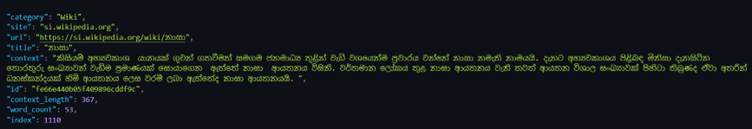

# Sinhala Web Scraping Dataset

This repository contains scripts to scrape Sinhala news articles and Wikipedia pages from various sources, including **Hiru News**, **Adaderana**, **Ada Lankadeepa**, **Divaina**, and **Sinhala Wikipedia**. The scraped data is stored in a structured format, making it suitable for various NLP tasks.

## 📝 Dataset Format

Each scraped article is stored with the following fields:

```json
{
  "category": "Type of passage",
  "site": "Source of passage",
  "url": "URL to the passage article",
  "title": "Title of article",
  "context": "Extracted passage",
  "id": "Unique ID generated per passage",
  "context_length": "Length of passage",
  "word_count": "Count of words in the passage",
  "index": "Index of row"
}
```
## Category Distribution
| Category            |	Passage Count |
|---------------------|---------------|
| All-news            |  6,047        |
| Local news	        |  4,088        |
| Wikipedia	          |  2,857        |
| International news	|  1,666        |
| Sports news	        |    392        |
| Business news	      |    271        |
| Entertainment News	|    105        |

## Source Distribution

| Source              |	Passage Count |
|---------------------|---------------|
| Lankadeepa          |  6,047        |
| Hiru news	          |  3,564        |
| Wikipedia	          |  2,857        |
| Adaderana	          |  2,235        |
| Divaina	            |    723        | 


### Sample Dataset Entry
Figure 1: Example dataset entry showing all fields


